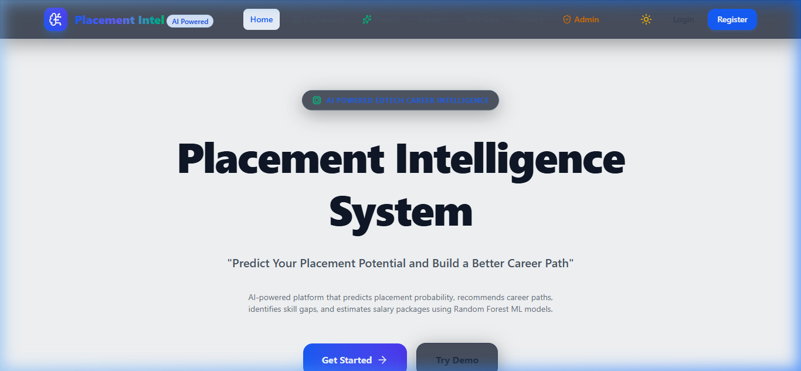
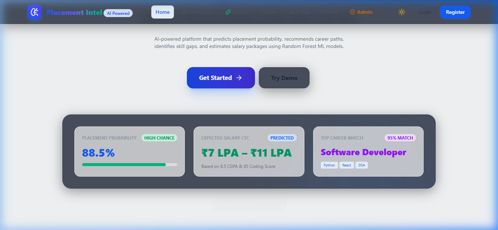
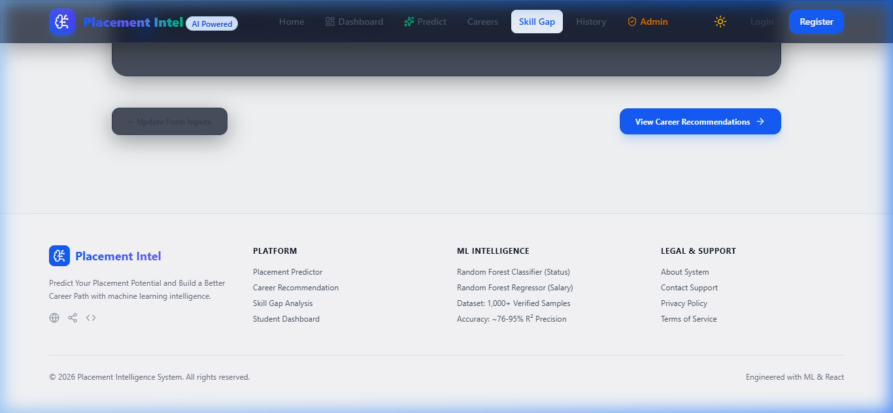
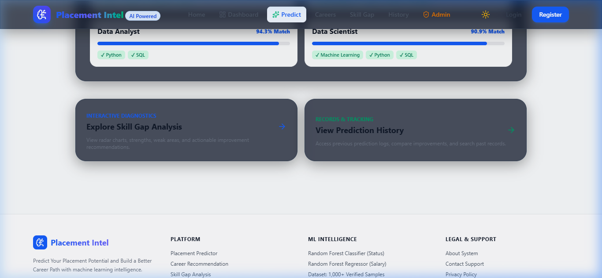
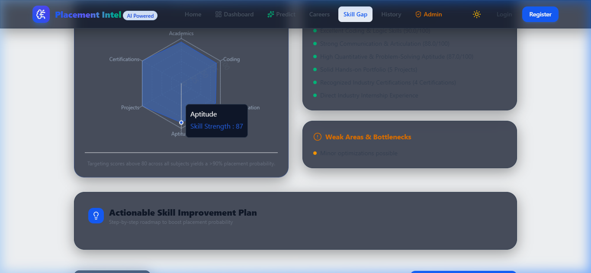
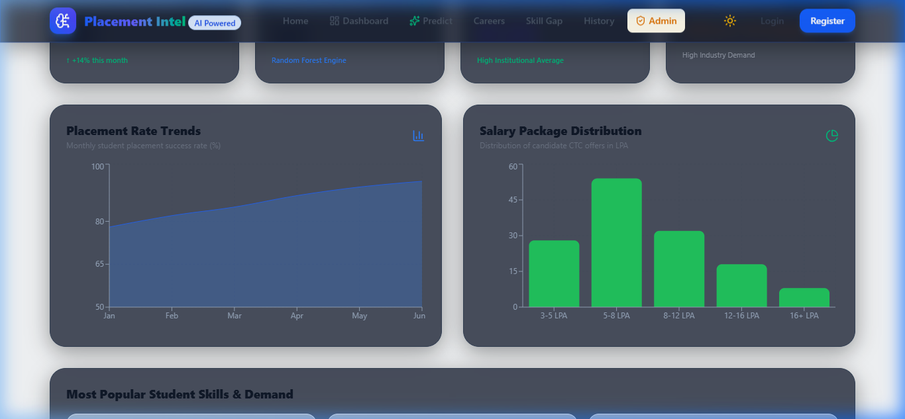

# 🎓 Placement Intelligence System Using Machine Learning

> **"Predict Your Placement Potential and Build a Better Career Path"**

[](https://www.python.org/)
[](https://reactjs.org/)
[](https://tailwindcss.com/)
[](https://scikit-learn.org/)
[](https://flask.palletsprojects.com/)
[](LICENSE)

An AI-powered, production-grade EdTech platform that predicts student placement probability, estimates expected salary packages (CTC), recommends tailored tech career paths, and performs diagnostic skill-gap analysis using **Random Forest Machine Learning** algorithms.

---

## 🌟 Key Features

* **Placement Probability Predictor**: `RandomForestClassifier` calculates candidate probability (%) and classifies outcome:
  * 🟢 **High Chance**: &gt; 75%
  * 🟠 **Medium Chance**: 50% – 75%
  * 🔴 **Low Chance**: &lt; 50%
* **Salary CTC Package Predictor**: `RandomForestRegressor` forecasts realistic expected CTC range in LPA based on past placement benchmarks.
* **Algorithmic Career Recommendation**: Smart skill-role matrix matching candidate profile against tech roles (*Software Developer, Data Analyst, Data Scientist, Frontend Dev, Backend Dev, QA Engineer, Cloud/DevOps*).
* **Skill Gap Analysis Module**: Interactive radar chart diagnostic highlighting core strengths, weak areas, and generating step-by-step improvement roadmaps.
* **Student Dashboard**: Unified hub tracking historical predictions, profile metrics, skill strength scores, and job market readiness.
* **Admin Dashboard & Analytics**: Institutional analytics hub featuring KPI cards, placement trend area charts, salary distribution histograms, popular skill demand rankings, and registered user databases.
* **Authentication**: Student sign-in and registration with college, branch, and academic year tracking.
* **Interactive UI**: Responsive modern SaaS aesthetics, dark/light mode toggle, glassmorphism card designs, and confetti celebration effects.

---

## 📸 Screenshots & UI Showcase

### 1. Landing Page


### 2. Student Dashboard & Quick Stats


### 3. Placement Prediction Form & Demo Presets


### 4. Prediction Results & CTC Range


### 5. Skill Gap Analysis & Radar Chart


### 6. Admin Analytics Dashboard


---

## 🏗 Repository Structure

```text
Placement-prdiction/
├── frontend/                 # React + Vite + Tailwind CSS Source Code
│   ├── src/
│   │   ├── components/       # GaugeChart, RadarChart, Navbar, Sidebar, Footer
│   │   ├── pages/            # LandingPage, Dashboard, PredictPage, ResultPage, etc.
│   │   ├── context/          # Auth & Theme State Context
│   │   ├── utils/            # API Communication Layer
│   │   ├── App.jsx
│   │   └── index.css
│   ├── package.json
│   └── vite.config.js
├── backend/                  # Python Flask API & ML Pipeline
│   ├── app.py                # Flask REST API Server
│   ├── generate_data.py      # Dataset Synthesis Script (1,000 Records)
│   └── train_models.py       # Random Forest Training Script
├── datasets/                 # CSV Machine Learning Training Datasets
│   ├── placement_dataset.csv
│   └── salary_dataset.csv
├── models/                   # Serialized Trained Model Pickles (.pkl)
│   ├── placement_model.pkl
│   └── salary_model.pkl
├── api/                      # Modular API Backend Handler
│   └── app.py
├── static/                   # Production Static Assets
├── templates/                # Server-rendered HTML Fallbacks
├── screenshots/              # High-Resolution UI Screenshots
├── requirements.txt          # Python Dependencies
├── .gitignore                # Git Exclusions
├── LICENSE                   # MIT License
└── README.md                 # Project Documentation
```

---

## 🛠 Technology Stack

* **Frontend**: React 18, Vite, Tailwind CSS v4, Lucide Icons, Recharts, Canvas-Confetti
* **Backend API**: Python 3.12, Flask, Flask-CORS
* **Machine Learning**: Scikit-Learn (Random Forest), Pandas, NumPy, Joblib
* **Data Storage**: CSV Datasets, In-Memory Persistent State / SQLite

---

## ⚙️ Installation & Setup Instructions

### Prerequisites
* Python 3.9+
* Node.js v18+ & npm

### 1. Clone the Repository
```bash
git clone https://github.com/Shannu0609/Placement-prdiction.git
cd Placement-prdiction
```

### 2. Backend Setup & Model Training
```bash
# Install Python dependencies
pip install -r requirements.txt

# Generate datasets & train Random Forest models
cd backend
python generate_data.py
python train_models.py

# Start Flask API server (Runs on http://localhost:5000)
python app.py
```

### 3. Frontend Setup
```bash
# Open a new terminal tab and navigate to frontend directory
cd frontend

# Install Node dependencies
npm install

# Start Vite development server (Runs on http://localhost:3000)
npm run dev
```

Open your browser and visit **`http://localhost:3000`**.

---

## 📡 API Endpoints Summary

| Method | Endpoint | Description |
| :--- | :--- | :--- |
| `POST` | `/api/predict` | Computes placement probability % & category using `RandomForestClassifier` |
| `POST` | `/api/salary-predict` | Predicts expected salary CTC range in LPA using `RandomForestRegressor` |
| `POST` | `/api/career-recommend` | Algorithmic skill-role compatibility matching engine |
| `POST` | `/api/skill-analysis` | Generates radar chart data, strengths, weak areas & improvement checklist |
| `GET` | `/api/history` | Retrieves historical prediction logs |
| `POST` | `/api/auth/login` | Student authentication endpoint |
| `POST` | `/api/auth/register` | New student registration endpoint |
| `GET` | `/api/admin/stats` | Aggregated institutional metrics & analytics |

---

## 🚀 Future Enhancements

* 📄 **AI Resume Analyzer**: Automated resume parsing & ATS score calculation.
* 🤖 **AI Mock Interview Coach**: Interactive voice/text interview simulator for technical & HR rounds.
* 🏢 **Company Recommendation Engine**: Matching candidates to top recruiting companies based on skill benchmarks.
* 📊 **Deep Placement Analytics**: Predictive campus placement drive scheduling & batch performance forecasting.

---

## 📜 License

Distributed under the MIT License. See `LICENSE` for more details.